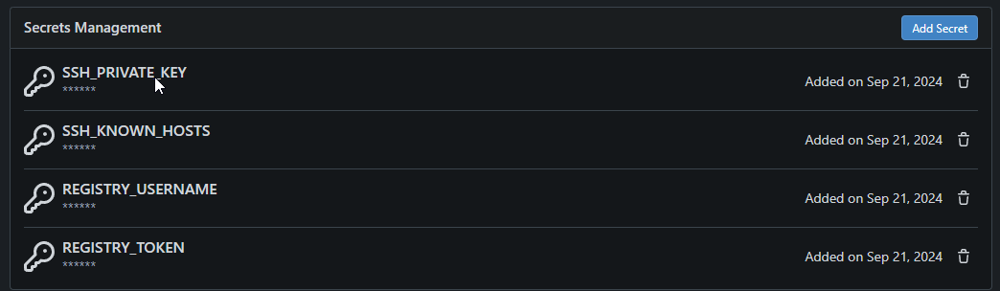
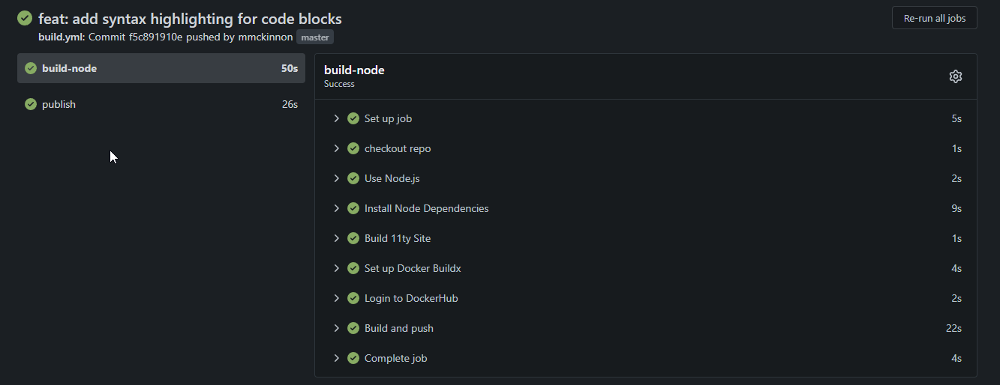

Since the reset of the website, I have been working on getting it to auto build and deploy using [Gitea Actions](https://docs.gitea.com/usage/actions/overview). Which is similar and compatible to [GitHub Actions](https://github.com/features/actions) 

Before implementing the action it was a manual process which required using docker commands to login, build and push the image to the container registry.


### Why use CI/CD?

It takes the manual process steps away and does them for you, helping you to avoid missing any steps and avoiding errors. This also makes the interaction seamless and automated.

### Setting up the Aciton

To setup the action we first needed to create some "secrets" in the repo. Secrets are secure variables that are requied to interact with systems. Such as passwords, usernames, SSH Keys etc.



After populating our secrets file we can then create our ```.gitea/workflows/build.yml``` file. This file contains all the steps to build, test and deploy the container.


```yml
on: push
jobs:
  build-node:
    runs-on: ubuntu-latest
    container:
      image: catthehacker/ubuntu:act-latest
    steps:
      - name: checkout repo
        uses: actions/checkout@v4
      
      - name: Use Node.js
        uses: actions/setup-node@v4
      
      - name: Install Node Dependencies
        run: npm ci

      - name: Build 11ty Site
        run: npm run build --if-present
      
      - name: Set up Docker Buildx
        uses: docker/setup-buildx-action@v3

      - name: Login to DockerHub
        uses: docker/login-action@v3
        with:
          registry: git.comprofix.com
          username: ${{ secrets.REGISTRY_USERNAME }}
          password: ${{ secrets.REGISTRY_TOKEN }}
      
      - name: Build and push
        uses: docker/build-push-action@v6
        with:
          context: ./
          file: ./Dockerfile
          push: true
          tags: git.comprofix.com/mmckinnon/comprofix.com:latest
  
  publish:
    runs-on: ubuntu-latest
    steps:
      - name: checkout repo
        uses: actions/checkout@v4

      - name: Publish Website
        run: |
          mkdir ~/.ssh
          echo "${{ secrets.SSH_KNOWN_HOSTS }}" >> ~/.ssh/known_hosts
          chmod 644 ~/.ssh/known_hosts
          eval $(ssh-agent -s)
          ssh-add <(echo "${{ secrets.SSH_PRIVATE_KEY }}")
          ssh administrator@comprofix.com "cd /opt/comprofix; docker compose down" || true
          scp docker-compose.yml administrator@comprofix.com:/opt/comprofix
          ssh administrator@comprofix.com "cd /opt/comprofix; docker compose pull; docker compose up -d"
```


### build.yml explained

* ```yml
  on: push
  ``` 
  This tells the action to run when code is pushed to the repo.
* ```yml
  runs-on: ubuntu-latest
  container:
    image: catthehacker/ubuntu:act-latest
  ```
  This specified the "container" to use to run all the steps on. This was crucial as running without a "conatiner" would fail as not all required dependencies where available
* ```yml 
  jobs:
    build-node:
    ...
    publish:
  ```
  These are the names of the separate jobs for the build action. The build node will build the site and create the new docker container and push to the registry. The publish will connect the host running the container and restart using the new container.
* ```yml
  steps:
  ```
  Each job has a list of steps it performs on the code. Most of these a pretty self explaining on what they do. Everything from check out the code. Setup Node environment and build. Run the docker commands to login to the registry, build the container and push. Then the last job steps connect the host and pull the new container and start.


### Gitea Action Completes

Once the new code was commited to the repo the Action was able to complete successfully.


